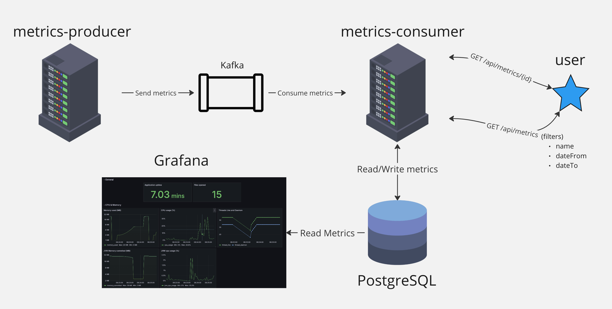

# Демонстрация работы consumer и producer Java Spring Boot с использованием Kafka, Zookeeper, Postgres и Grafana

## Producer

Producer отправляет метрики в Kafka каждые 5 секунд.

### Названия метрик:
- system.cpu.usage
- process.uptime
- jvm.memory.used
- jvm.memory.committed
- jvm.gc.memory.allocated
- jvm.threads.live
- jvm.threads.daemon
- process.files.open
- process.cpu.usage

Все метрики отправляются в топик `metrics-event`.

## Consumer

Consumer считывает сообщения из Kafka и записывает их в PostgreSQL. У Consumer есть два endpoint:

- `/api/metrics` - возвращает все метрики из базы данных с фильтрами:
    - `name` - название метрики
    - `timeFrom` - дата начала периода (формат: ISO, пример 2021-10-01T00:00:00.000Z)
    - `timeTo` - дата окончания периода (формат: ISO, пример 2021-10-01T00:00:00.000Z)
- `/api/metrics/{id}` - возвращает метрику по id

Документация и примеры запросов доступны по адресу `http://localhost:8081/swagger-ui/index.html`.

# Grafana

Grafana подключена к PostgreSQL и отображает графики по метрикам. В Grafana уже встроены дашборды с графиками и подключением к PostgreSQL по всем метрикам. Доступны по адресу `http://localhost:3000/`.

Логин по умолчанию: admin

Пароль по умолчанию: admin

# Запуск приложения

Все сервисы запускаются в Docker compose командой `docker-compose up`.
